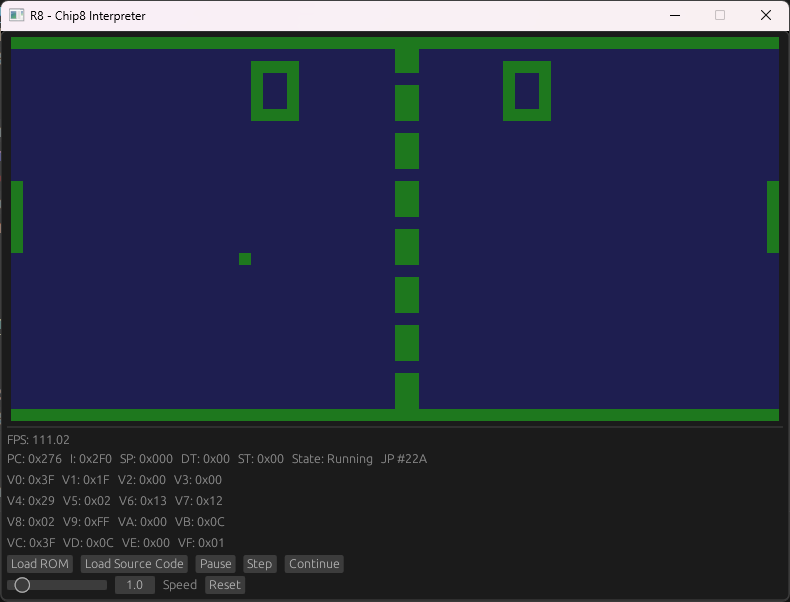

# R8: Yet Another CHIP-8 Interpreter in Rust 😉

R8 is a CHIP-8 emulator written in Rust, using [sdl2](https://www.libsdl.org/) and [egui](https://www.egui.rs/). With an small GUI for debugging, control the emulator speed and step cycle by cicle, loading roms and assembling source code.



## How to run it

### Install Rust

Follow the instructions on the [Rust website](https://www.rust-lang.org/tools/install).

### Clone the repository

```bash
git clone https://github.com/CarlosEduardoL/R8
```

### Run the interpreter

```bash
cd R8
cargo run --release --features "sdl2-gui"
```

## What is CHIP-8?

CHIP-8 is an interpreted programming language that was used to create games for some home computers in the 1970s and 1980s. It has a simple instruction set and graphics system, and it can run on various platforms with minimal changes.

## Current state

- All opcodes are implemented
- The display works
- The keyboard works
- The timers work
- The sound works
- The debugger works
- The GUI works
- The roms drag and drop works
- Use default system file explorer to load roms
- The assembler works
- You can load a plain text assembler file and run it
- You can use a slider to change the speed of the emulator

## Possible improvements

- Add a Wasm version
- Add a TUI version
- Add a disassembler
- Add the posibility to save/load state

## References

I used the following sources to learn about CHIP-8 and implement the emulator:

- [Wikipedia article on CHIP-8](https://en.wikipedia.org/wiki/CHIP-8)
- [CHIP-8 Technical Reference](http://devernay.free.fr/hacks/chip8/C8TECH10.HTM)
- [Mastering CHIP-8](https://github.com/mattmikolay/chip-8/wiki/Mastering-CHIP%E2%80%908)

## ROMS source

- [Public Domain Roms](https://www.zophar.net/pdroms/chip8.html)
