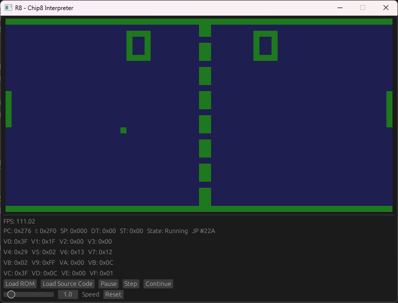

# R8: Yet Another CHIP-8 Interpreter in Rust 😉

R8 is a CHIP-8 emulator written in Rust. Designed to be modular so the emulator logic can be attached to any frontend, the project currently has 2 frontends: a Bevy-based one with graphical user interface and debug tools, and a simple CLI interface for those who prefer terminal interfaces. It also offers an assembly toolkit to build your own games using the emulator.

```bash
cargo run --release --bin gui
cargo run --release --bin tui -- --rom roms/PONG.ch8
```



# Build & Run

Build everything from the workspace root:

```bash
cargo build
```

The GUI binary opens a file dialog to load ROMs, no CLI arguments needed. The TUI binary needs a rom path or an assembly file:

```bash
cargo run --release --bin tui -- --rom roms/PONG.ch8
cargo run --release --bin tui -- --asm assembly_roms/pong.8s
```

Pass `-d` to the TUI for debug logging.

# Use it as a library

The project is split so you can depend on only what you need. `r8-core` is the foundation with zero dependencies: memory, registers, opcodes, timers, and stack. `r8-emulator` builds on top of it and drives the emulation loop. Together they let you embed a CHIP-8 runtime into any program.

If you only want an assembler, depend on `r8-assembly`. It takes `.8s` source text and returns ROM bytes, with `r8-core` as its only dependency.

If you want to build a new frontend, depend on `r8-emulator` and wire it up yourself:

```rust
use r8_emulator::Emulator;

fn main() {
    let mut emu = Emulator::new();
    let rom = std::fs::File::open("roms/PONG.ch8").unwrap();
    emu.load_rom(rom).unwrap();

    loop {
        emu.tick().unwrap();
        // emu.display() for frame data
        // emu.press_key() / emu.release_key() for input
    }
}
```

# Dependencies

`r8-core` and `r8-assembly` have no external dependencies beyond the Rust standard library. `r8-emulator` only adds `log`. You can build and use these without pulling in any system libraries.

The frontends are another story. `r8-gui` uses Bevy which pulls in OpenGL/Vulkan, Wayland, and audio system libraries. On Fedora you will need `wayland-devel` and friends. On Ubuntu it is `libwayland-dev`. `r8-tui` uses crossterm and is lighter but still needs a terminal that supports raw mode.

```bash
# Fedora
sudo dnf install wayland-devel libxkbcommon-devel alsa-lib-devel systemd-devel

# Ubuntu / Debian
sudo apt install libwayland-dev libxkbcommon-dev libasound2-dev libudev-dev
```

# What works

All the emulator capabilities from simple CHIP-8 work, and the GUI provides a debugger to see the registers and memory around important pointers.

The future plan is to allow edit mode in the debugger and add support for extended versions of CHIP-8 like XO-CHIP and SuperChip.

# References

- [CHIP-8 reference](http://devernay.free.fr/hacks/chip8/C8TECH10.HTM)
- [Mastering CHIP-8](https://github.com/mattmikolay/chip-8/wiki/Mastering-CHIP-8)

# License

MIT, see [LICENSE](LICENSE).
